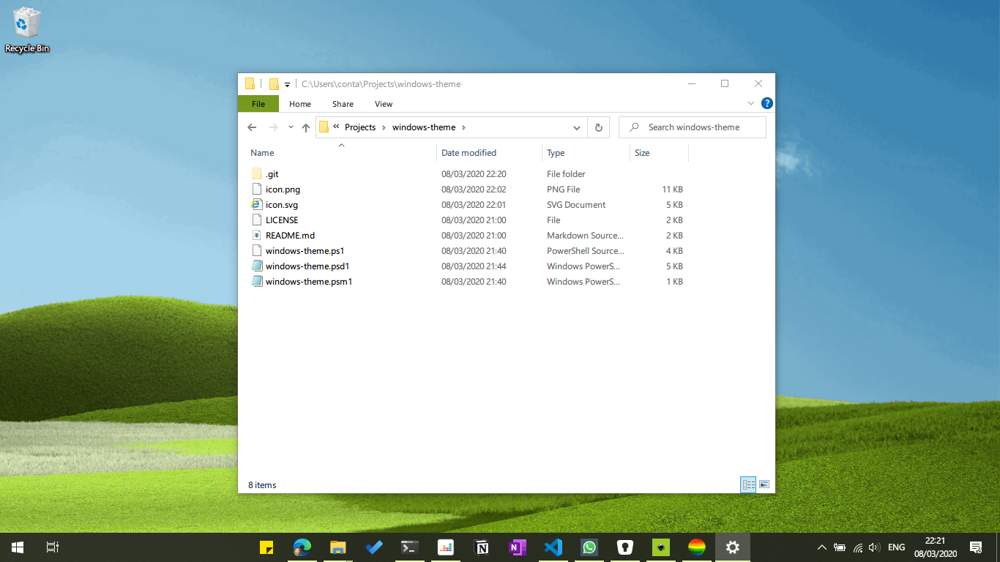
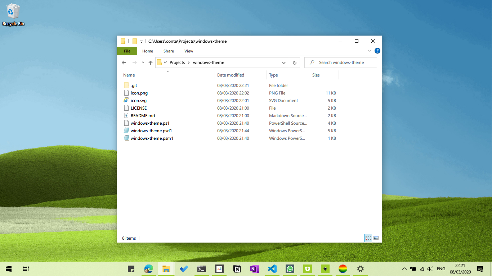
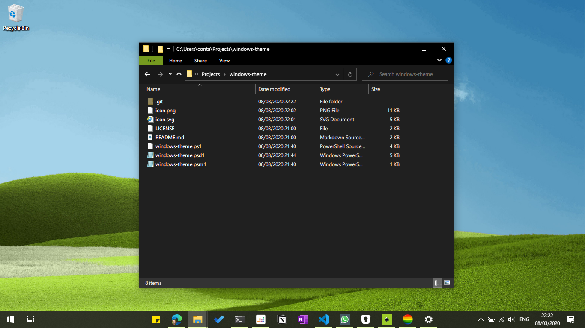
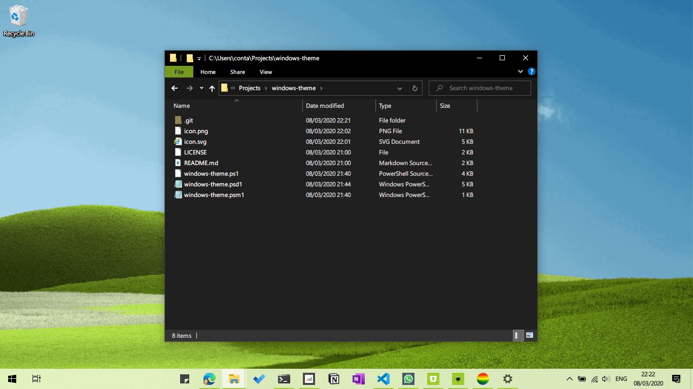

# windows-theme
> Powershell module to easily switch between Windows 10 Light and Dark themes.


## Requirements
* Windows 10
* Powershell version 5 or higher or Powershell core

## Install

First, [see the instructions to enable PSGallery repository in PowerShell](https://docs.microsoft.com/en-us/powershell/scripting/gallery/overview), then proceed to `windows-theme` module instalation. 

Open a powershell terminal and enter de following command:
```powershell
Install-Module -Name windows-theme
```

## Usage
```powershell
Get-WindowsTheme # show what theme config is in use for system and apps
win-theme-default # enable default theme (dark bar, light apps). Same as Use-WindowsDefaultTheme
win-theme-inverted # enable inverted theme (light bar, dark apps). Same as Use-WindowsInvertedTheme
win-theme-light # enable light theme. Same as Use-WindowsLightTheme
win-theme-dark # enable dark theme. Same as Use-WindowsDarkTheme
Set-WindowsTheme -System dark -Apps light # set -System and -Apps theme separately
Get-WindowsAppsTheme # show theme in use for apps
Set-WindowsAppsTheme dark # set theme for apps only
Get-WindowsSystemTheme # show theme in use for system only
Set-WindowsSystemTheme light # set theme for system only
```

Possible values for params are: `light` or `dark`.

## Themes

### win-theme-default



### win-theme-light



### win-theme-dark



### win-theme-inverted


